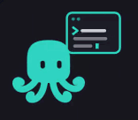
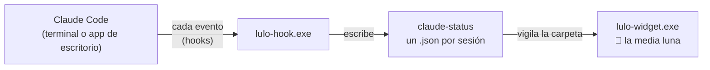

# Lulo el Pulpo


Un pulpo que vive en el borde de arriba de tu pantalla y te avisa qué está haciendo cada sesión de Claude Code: pensando, editando, en el bash, leyendo, con un subagente, esperando permiso o terminada. Es un widget para Windows, siempre visible, gratis y de código abierto.

**[Descargar Lulo-Setup.exe](https://github.com/festupinans/Lulo/releases/latest)** · [Guía de instalación](INSTALACION.md)

> Lulo es un proyecto independiente, no afiliado a Anthropic ni respaldado por ella. Claude y Claude Code son marcas de Anthropic.

El instalador no está firmado, así que Windows puede mostrar el aviso de SmartScreen la primera vez. Todo el código está en este repositorio para que puedas revisarlo o compilarlo tú mismo.

<p align="center">
  
</p>

## Así se ve

Lulo es una media luna oscura pegada al borde de arriba de la pantalla. El pulpo cuelga de cabeza y asoma solo los ojos, y debajo hay un punto de color por cada sesión. Al pasar el ratón se abre una ficha por sesión, con su proyecto, su estado, el tiempo que lleva y la barra de tareas.

<p align="center">
  
</p>

## Un pulpo por estado

Cada estado tiene su color y su propia escena animada.

<table>
  <tr>
    <td align="center" width="25%"><br><b>Pensando</b><br><sub>Claude razona tu pedido</sub></td>
    <td align="center" width="25%"><br><b>Editando</b><br><sub>Escribe o cambia archivos</sub></td>
    <td align="center" width="25%"><br><b>Bash</b><br><sub>Corre un comando</sub></td>
    <td align="center" width="25%"><br><b>Leyendo</b><br><sub>Lee, busca o consulta la web</sub></td>
  </tr>
  <tr>
    <td align="center"><br><b>Subagente</b><br><sub>Le pasó trabajo a un ayudante</sub></td>
    <td align="center"><br><b>Esperando</b><br><sub>Necesita tu permiso o tu respuesta</sub></td>
    <td align="center"><br><b>Terminó</b><br><sub>Acabó su turno</sub></td>
    <td align="center"><br><b>Error</b><br><sub>Algo falló</sub></td>
  </tr>
</table>

Además, una sesión sin eventos durante 5 minutos pasa a **Inactiva** (gris, el pulpo duerme), y una que terminó su turno con comandos o subagentes aún corriendo sale **En segundo plano**.

## Reacciones

Plegado, el pulpo tiene su propia personalidad. Se sobresalta cuando una sesión empieza a esperarte, celebra con papelitos cuando una termina, se enoja si le das 3 clics seguidos y con 5 se esconde en la luna antes de volver a asomar un ojo.

<p align="center">
  
</p>

Si todo lleva 2 minutos terminado, se aburre y juega con un yoyó. En Windows también sigue el ratón con la mirada cuando pasa cerca y guiña un ojo de vez en cuando mientras trabaja.

<p align="center">
  
</p>

## Sonidos

Cuando una sesión cambia a un estado que importa, sale una notificación de Windows y suena un sonido corto. Todos están sintetizados con código en [`assets/sounds/synth.py`](assets/sounds/synth.py), sin grabaciones de terceros.

| Cuándo suena | Sonido | Escuchar |
|---|---|---|
| Una sesión te espera | Burbujas | [esperando.wav](assets/sounds/esperando.wav) |
| Una sesión terminó | Plop | [termino.wav](assets/sounds/termino.wav) |
| Una sesión falló | Glub | [error.wav](assets/sounds/error.wav) |
| Empieza una sesión nueva (apagado por defecto) | Burbuja | [nueva.wav](assets/sounds/nueva.wav) |

## Cómo funciona



Funciona con [hooks de Claude Code](https://code.claude.com/docs/en/hooks): cada evento ejecuta `lulo-hook.exe`, que escribe el estado de la sesión en `%LOCALAPPDATA%\claude-status\<session_id>.json`. `lulo-widget.exe` vigila esa carpeta y muestra un punto y una ficha por sesión. No hay servidores ni navegador: el widget está escrito en Rust con [egui](https://github.com/emilk/egui).

**Para instalarlo, sigue la [guía de instalación](INSTALACION.md).**

## Estado del proyecto

- [x] Fase 1: binario del hook e instalación en `settings.json`
- [x] Fase 2: widget básico que lista las sesiones
- [x] Fase 3: colores, iconos, posición y arrastre
- [x] Fase 4: sesiones inactivas y pulido

## Instalar el hook

La forma más fácil es `Lulo-Setup.exe` de la [última versión](https://github.com/festupinans/Lulo/releases/latest): hace los pasos de abajo y deja Lulo en Configuración > Aplicaciones para desinstalarlo. Cómo se compila y se firma está en [installer/README.md](installer/README.md).

A mano:

1. Descarga `lulo-windows-x64.zip` de la [última versión](https://github.com/festupinans/Lulo/releases/latest) (trae `lulo-hook.exe` y `lulo-widget.exe`) o compílalos con `cargo build --release`.
2. Haz doble clic en `lulo-hook.exe`. Se copia a `%LOCALAPPDATA%\Lulo\lulo-hook.exe` y añade los hooks a `~/.claude/settings.json` sin tocar el resto del archivo, guardando antes una copia (`settings.json.lulo-backup-<fecha>`). Puedes repetirlo cuando quieras: nunca duplica entradas. Si `lulo-widget.exe` está en la misma carpeta, también lo copia y lo abre.
3. Reinicia las sesiones de Claude Code abiertas para que carguen los hooks.

Desde una terminal también funcionan `lulo-hook.exe install`, `lulo-hook.exe uninstall` y `lulo-hook.exe status-dir` (carpeta donde escribe los estados).

## Abrir el widget

Haz doble clic en `lulo-widget.exe`. Aparece como una media luna oscura pegada al borde de arriba, en el centro de la pantalla, siempre encima y fuera de la barra de tareas.

- **Plegada:** solo la media luna, sin texto. El pulpo cuelga de cabeza y asoma la coronilla y los ojos, y debajo hay un punto de color por cada sesión activa. Los ojos siguen a la sesión que más te necesita: miran a los lados si una espera, se vuelven X con un error, sonríen al terminar y se cierran si no hay actividad.
- **Reacciones:** plegado, el pulpo sigue el ratón con la mirada cuando pasa cerca, guiña un ojo de vez en cuando mientras trabaja, celebra con papelitos cuando una sesión termina y se sobresalta cuando una empieza a esperarte. Si todo terminó hace 2 minutos se aburre y juega con un yo-yo. Con 3 clics seguidos sobre él se enoja, y con 5 se esconde en la luna y luego asoma un ojo. Nada de esto tapa un aviso de espera o de error.
- **Al pasar el ratón:** debajo de la luna aparece una ficha por sesión (pulpo, proyecto, estado, tiempo en ese estado y barra de tareas hechas), sin marco ni fondo. Se vuelve a plegar al sacar el ratón. El tiempo cuenta desde que enviaste el pedido mientras Claude trabaja, y desde el cambio de estado cuando espera, termina o falla.
- **Clic en una ficha:** trae al frente la ventana de esa sesión: la terminal donde corre o la app de escritorio de Claude. Dentro de la app no elige la sesión exacta.
- **Avisos y sonidos:** cuando una sesión pasa a "Esperando", termina o da error, sale una notificación de Windows y suena Burbujas, Plop o Glub. Con No molestar activo, o con algo en pantalla completa, no suena. Nunca suena más de una vez cada 2 s.
- **Pantalla completa:** con un video, un juego o una presentación en pantalla completa la luna se esconde, y vuelve sola si una sesión espera o falla.
- **El pulpo de cada ficha:** hace la escena de ese estado. Piensa, teclea frente al PC, mira la terminal, busca con lupa, llama a pulpitos ayudantes, espera impaciente, salta al terminar, tiembla con un error y duerme si no hay actividad.
- **Segundo plano:** Lulo cuenta los comandos, monitores (`Monitor`) y subagentes que Claude deja corriendo en segundo plano, también los comandos que Claude Code manda al fondo por sí solo. Mientras Claude sigue trabajando, la ficha lo indica junto al estado con un punto violeta que late y la cantidad («+1»). Si Claude termina su turno con alguno vivo, la sesión sale «En segundo plano» en vez de «Terminó». Cada tarea sale de la cuenta cuando Claude Code avisa que acabó (`<task-notification>`) o cuando Claude la detiene con `TaskStop`.
- **Menú (clic derecho):** "Iniciar con Windows", "Avisos de Windows", "Sonidos", "Esconder en pantalla completa", "Pantalla" (con más de un monitor), "Posición" (izquierda, centro o derecha del borde de arriba) y "Cerrar Lulo". Sobre una sesión inactiva, también "Quitar de la lista".
- **Inactiva:** una sesión sin eventos durante 5 minutos pasa a "Inactiva" y baja al final. "Esperando" nunca pasa a inactiva, porque necesita que respondas.
- **Sesiones huérfanas:** si cierras una terminal sin `/exit`, Claude Code no envía `SessionEnd`. El widget borra esos archivos tras 12 horas sin eventos.
- **Consumo:** el pulpo se anima a 12 cuadros por segundo plegado y a 30 desplegado. Con `"animate": false` queda quieto y el widget solo se redibuja cuando cambia un archivo de estado o el ratón está encima, más un refresco cada 15 s para los tiempos.

La configuración está en `%LOCALAPPDATA%\Lulo\widget.json`:

```json
{
  "animate": true, "inactive_minutes": 5, "forget_hours": 12,
  "notifications": true, "sounds": true, "new_session_sound": false,
  "hide_fullscreen": true, "monitor": 0, "anchor": "centro"
}
```

### Sobre la lista de tareas

La lista sale de las herramientas de tareas de Claude Code (`TaskCreate`/`TaskUpdate`, o `TodoWrite` en versiones antiguas). En los modelos más nuevos Claude Code no las activa por defecto, así que la barra de la ficha queda vacía hasta que la sesión termina. Para activarlas, arranca Claude Code con la variable de entorno `CLAUDE_CODE_ENABLE_TODO_TOOLS=1` (por ejemplo, `setx CLAUDE_CODE_ENABLE_TODO_TOOLS 1` en Windows y reinicia la terminal).

## Archivo de estado

```json
{"session_id":"0b6c…","project":"Lulo","cwd":"C:\\dev\\Lulo","state":"editing","detail":"main.rs","event":"PreToolUse","ts":1759256718}
```

`ts` son segundos Unix del último evento. `detail` es una pista corta (archivo, comando, descripción del subagente) o `null`. Además, el hook guarda:

- `prompt` y `started`: el último pedido (recortado) y cuándo se envió.
- `steps`: las últimas 15 acciones de ese pedido (`state`, `detail`, `ts`).
- `tasks`: la lista de tareas de Claude (`text`, `status`: `pending`, `in_progress` o `completed`), a partir de `TodoWrite`, `TaskCreated`, `TaskUpdate` y `TaskCompleted`.
- `background`: lo que sigue corriendo en segundo plano (`id` del `tool_use`, `task` que le dio Claude Code, `kind`: `shell`, `monitor` o `agent`, y `detail`).

Los avisos de Claude Code de que una tarea en segundo plano acabó llegan como `UserPromptSubmit` con un `<task-notification>`. El hook los usa para sacar la tarea de `background`, pero no los toma como el pedido: `prompt`, `started` y `steps` siguen siendo los del último mensaje tuyo.

| Evento | `state` |
|---|---|
| `SessionStart` | `ready` |
| `UserPromptSubmit`, `PostToolUse`, `PostToolUseFailure`, `SubagentStop` | `thinking` |
| `PreToolUse` Edit, MultiEdit, Write, NotebookEdit | `editing` |
| `PreToolUse` Bash, PowerShell | `bash` |
| `PreToolUse` Read, Grep, Glob, WebFetch, WebSearch | `reading` |
| `PreToolUse` Agent (antes Task) | `subagent` |
| `PreToolUse` cualquier otra herramienta (MCP, etc.) | `tool` |
| `PermissionRequest`; `Notification` de permiso o de espera de input | `waiting` |
| `Stop` | `done` |
| `StopFailure` | `error` |
| `SessionEnd` | borra el archivo |

Los eventos que vienen de dentro de un subagente (traen `agent_id`) solo actualizan `ts`, para que la sesión principal siga mostrando `subagent`. La excepción es `PermissionRequest`, que siempre pasa a `waiting`.

## Diseño del hook

- Se registra en forma "exec" (`command` + `args`): Claude Code lanza el `.exe` directamente, sin Git Bash ni PowerShell de por medio.
- Los hooks son síncronos para que los estados nunca lleguen desordenados. El binario tarda unos pocos milisegundos: lee el stdin, escribe un archivo y sale.
- Escritura atómica (archivo temporal + renombrar), para que el widget nunca lea un JSON a medias.
- Nunca imprime en stdout ni devuelve error: un fallo del hook no puede bloquear a Claude.
- Única dependencia: `serde_json`.

## Desarrollo

```sh
cargo test
cargo clippy --all-targets -- -D warnings
```

`LULO_STATUS_DIR` cambia la carpeta de estado (útil en pruebas). Fuera de Windows se usa `~/.local/state/claude-status`.

## Licencia

[MIT](LICENSE). Puedes usar, copiar, modificar y distribuir Lulo libremente, manteniendo el aviso de copyright.
